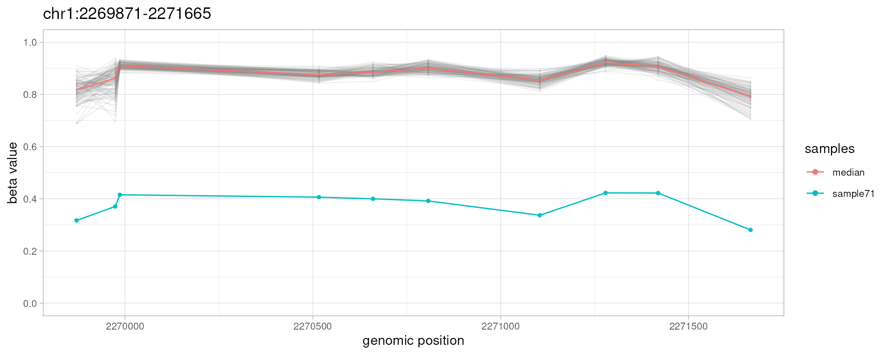
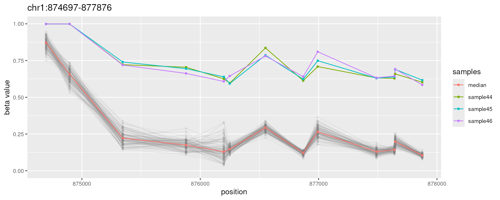
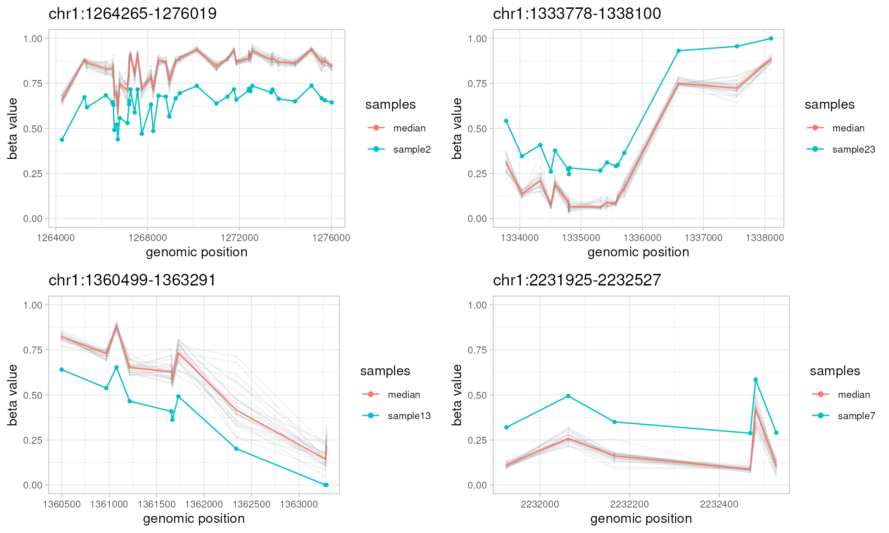
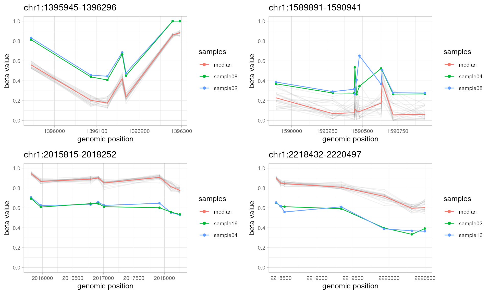
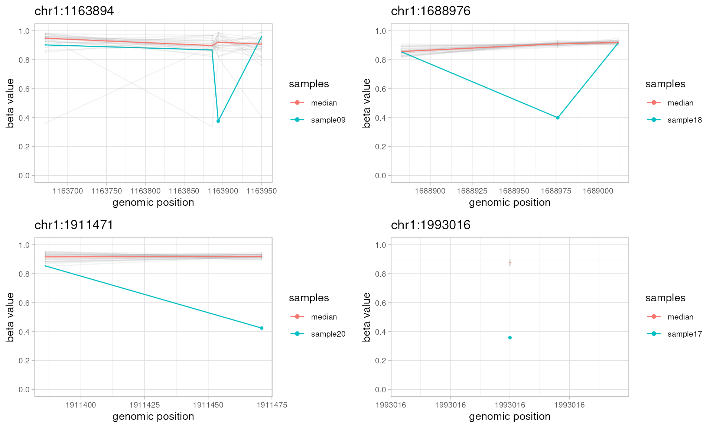
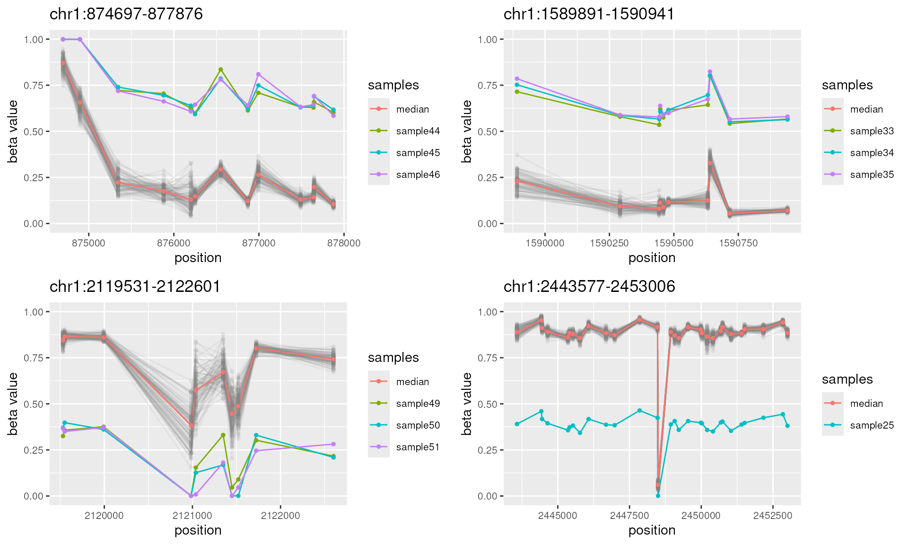

# The ramr User's Guide

Abstract

A comprehensive guide to using the ramr package for detection of rare
aberrantly methylated regions (epimutations).

## Introduction

`ramr` is an R package for detection of low-frequency aberrant
methylation events (epimutations) in large data sets obtained by
methylation profiling using array or high-throughput methylation
sequencing. In addition, package provides functions to visualize found
aberrantly methylated regions (AMRs), to generate sets of all possible
regions to be used as reference sets for enrichment analysis, and to
generate biologically relevant test data sets for performance evaluation
of AMR/DMR search algorithms.

#### Current Features

- Identification of aberrantly methylated regions (AMRs, i.e.,
  epimutations)
- AMR visualization
- Generation of reference sets for third-party analyses (e.g.,
  enrichment)
- Generation of test data sets for performance evaluation of algorithms
  for search of differentially (DMR) or aberrantly (AMR) methylated
  regions

#### Major improvements

###### v1.16 \[BioC 3.21\]

- Major rewrite of `getAMR` and `simulateData` functions, which are now
  much faster (C/C++, OpenMP threads) and more robust (correctly deal
  with methylation sequencing data that often contains 0 and 1 values).
- Old functions `getAMR` and `simulateData` as they were described in
  the `ramr` paper are now obsolete, but kept under different names
  (`getAMR.obsolete` and `simulateData.obsolete`, respectively) for
  consistency.
- Cleaner and more robust AMR plotting.

## Reading data

`ramr` methods operate on objects of the class `GRanges`. The input
object for AMR search must in addition contain metadata columns with
sample beta values. A typical input object looks like this:

    GRanges object with 383788 ranges and 845 metadata columns:
                 seqnames    ranges strand |         GSM1235534         GSM1235535         GSM1235536 ...
                    <Rle> <IRanges>  <Rle> |          <numeric>          <numeric>          <numeric> ...
      cg13869341     chr1     15865      * |  0.801634776091808  0.846486905008704   0.86732154737116 ...
      cg24669183     chr1    534242      * |  0.834138820071765  0.861974610731835  0.832557979806823 ...
      cg15560884     chr1    710097      * |  0.711275180750356   0.70461945838556  0.699487225634589 ...
      cg01014490     chr1    714177      * | 0.0769098196182058 0.0569443780518647 0.0623154673389864 ...
      cg17505339     chr1    720865      * |  0.876413362222415  0.885593263385521  0.877944732153869 ...
             ...      ...       ...    ... .                ...                ...                ... ...
      cg05615487    chr22  51176407      * |   0.84904178467798  0.836538383875097   0.81568519870099 ...
      cg22122449    chr22  51176711      * |  0.882444486059592  0.870804215405886  0.859269224277308 ...
      cg08423507    chr22  51177982      * |  0.886406345093286  0.882430879852752  0.887241923657461 ...
      cg19565306    chr22  51222011      * | 0.0719084295670266 0.0845209871264646 0.0689074604483659 ...
      cg09226288    chr22  51225561      * |  0.724145303755024  0.696281176451351  0.711459675603635 ...

`ramr` package is supplied with a sample data, which was simulated using
GSE51032 data set as described in the `ramr` reference paper. Sample
data set `ramr.data` contains beta values for 10000 CpGs and 100 samples
(`ramr.samples`), and carries 6 unique (`ramr.tp.unique`) and 15
non-unique (`ramr.tp.nonunique`) true positive AMRs containing at least
10 CpGs with their beta values increased/decreased by 0.5

``` r

library(GenomicRanges)
#> Loading required package: stats4
#> Loading required package: BiocGenerics
#> Loading required package: generics
#> 
#> Attaching package: 'generics'
#> The following objects are masked from 'package:base':
#> 
#>     as.difftime, as.factor, as.ordered, intersect, is.element, setdiff, setequal, union
#> 
#> Attaching package: 'BiocGenerics'
#> The following objects are masked from 'package:stats':
#> 
#>     IQR, mad, sd, var, xtabs
#> The following objects are masked from 'package:base':
#> 
#>     anyDuplicated, aperm, append, as.data.frame, basename, cbind, colnames, dirname,
#>     do.call, duplicated, eval, evalq, Filter, Find, get, grep, grepl, is.unsorted,
#>     lapply, Map, mapply, match, mget, order, paste, pmax, pmax.int, pmin, pmin.int,
#>     Position, rank, rbind, Reduce, rownames, sapply, saveRDS, table, tapply, unique,
#>     unsplit, which.max, which.min
#> Loading required package: S4Vectors
#> 
#> Attaching package: 'S4Vectors'
#> The following object is masked from 'package:utils':
#> 
#>     findMatches
#> The following objects are masked from 'package:base':
#> 
#>     expand.grid, I, unname
#> Loading required package: IRanges
#> Loading required package: Seqinfo
library(ggplot2)
library(ramr)
data(ramr)

head(ramr.samples)
#> [1] "sample1" "sample2" "sample3" "sample4" "sample5" "sample6"
ramr.data[1:10,ramr.samples[1:3]]
#> GRanges object with 10 ranges and 3 metadata columns:
#>              seqnames    ranges strand |   sample1   sample2   sample3
#>                 <Rle> <IRanges>  <Rle> | <numeric> <numeric> <numeric>
#>   cg13869341     chr1     15865      * |  0.833609  0.847747  0.879959
#>   cg14008030     chr1     18827      * |  0.553312  0.547931  0.609759
#>   cg12045430     chr1     29407      * |  0.186572  0.204322  0.222865
#>   cg20826792     chr1     29425      * |  0.481280  0.439688  0.426783
#>   cg00381604     chr1     29435      * |  0.134126  0.173629  0.167011
#>   cg20253340     chr1     68849      * |  0.500267  0.615868  0.541587
#>   cg21870274     chr1     69591      * |  0.777613  0.771680  0.775057
#>   cg03130891     chr1     91550      * |  0.245783  0.204307  0.223610
#>   cg24335620     chr1    135252      * |  0.777796  0.790842  0.786113
#>   cg16162899     chr1    449076      * |  0.878150  0.860134  0.898071
#>   -------
#>   seqinfo: 24 sequences from hg19 genome; no seqlengths
plotAMR(data.ranges=ramr.data, amr.ranges=ramr.tp.unique[1])
#> Loading required namespace: GenomeInfoDb
#> Plotting 1 genomic ranges
#> 100%
#> [0.226s]
#> $`chr1:2269871-2271665`
```



``` r

plotAMR(data.ranges=ramr.data, amr.ranges=ramr.tp.nonunique[c(1,6,11)])
#> Plotting 1 genomic ranges
#> 100%
#> [0.148s]
#> $`chr1:874697-877876`
```



The input (or template) object may be obtained using data from various
sources. Here we provide two examples:

#### Using data from NCBI GEO

The following code pulls (NB: very large) raw files from NCBI GEO
database, performes normalization and creates `GRanges` object for
further analysis using `ramr` (system requirements: 22GB of disk space,
64GB of RAM)

    library(minfi)
    library(GEOquery)
    library(GenomicRanges)
    library(IlluminaHumanMethylation450kanno.ilmn12.hg19)

    # destination for temporary files
    dest.dir <- tempdir()

    # downloading and unpacking raw IDAT files
    suppl.files <- getGEOSuppFiles("GSE51032", baseDir=dest.dir, makeDirectory=FALSE, filter_regex="RAW")
    untar(rownames(suppl.files), exdir=dest.dir, verbose=TRUE)
    idat.files  <- list.files(dest.dir, pattern="idat.gz$", full.names=TRUE)
    sapply(idat.files, gunzip, overwrite=TRUE)

    # reading IDAT files
    geo.idat <- read.metharray.exp(dest.dir)
    colnames(geo.idat) <- gsub("(GSM\\d+).*", "\\1", colnames(geo.idat))

    # processing raw data
    genomic.ratio.set <- preprocessQuantile(geo.idat, mergeManifest=TRUE, fixOutliers=TRUE)

    # creating the GRanges object with beta values
    data.ranges <- granges(genomic.ratio.set)
    data.betas  <- getBeta(genomic.ratio.set)
    sample.ids  <- colnames(geo.idat)
    mcols(data.ranges) <- data.betas

    # data.ranges and sample.ids objects are now ready for AMR search using ramr

#### Using Bismark cytosine report files

    library(methylKit)
    library(GenomicRanges)

    # file.list is a user-defined character vector with full file names of Bismark cytosine report files
    file.list

    # sample.ids is a user-defined character vector holding sample names
    sample.ids

    # methylation context string, defines if the reads covering both strands will be merged
    context <- "CpG"

    # fitting beta distribution (filtering using ramr.method "beta" or "wbeta") requires
    # that most of the beta values are not equal to 0 or 1
    min.beta <- 0.001
    max.beta <- 0.999

    # reading and uniting methylation values
    meth.data.raw <- methRead(as.list(file.list), as.list(sample.ids), assembly="hg19", header=TRUE,
                              context=context, resolution="base", treatment=rep(0,length(sample.ids)),
                              pipeline="bismarkCytosineReport")
    meth.data.utd <- unite(meth.data.raw, destrand=isTRUE(context=="CpG"))

    # creating the GRanges object with beta values
    data.ranges <- GRanges(meth.data.utd)
    data.betas  <- percMethylation(meth.data.utd)/100
    data.betas[data.betas<min.beta] <- min.beta
    data.betas[data.betas>max.beta] <- max.beta
    mcols(data.ranges) <- data.betas

    # data.ranges and sample.ids objects are now ready for AMR search using ramr

## Simulating data

`ramr` provides methods to create sets of random AMRs and to generate
biologically relevant methylation beta values using real data sets as
templates. The following code provides an example, however it is
recommended to use a real experimental data (e.g. GSE51032) to create a
test data set for assessing the performance of `ramr` or other AMR/DMR
search engines. The results of data simulation are fully reproducible
when the same seed has been set (at a cost of serial random number
generation).

``` r

# set the seed if reproducible results required
  set.seed(999)

# unique random AMRs
  amrs.unique <-
    simulateAMR(template.ranges=ramr.data, nsamples=25, regions.per.sample=2,
                min.cpgs=5, merge.window=1000, dbeta=0.2)

# non-unique AMRs outside of regions with unique AMRs
  amrs.nonunique <-
    simulateAMR(template.ranges=ramr.data, nsamples=4, exclude.ranges=amrs.unique,
                sample.names=sprintf("sample%02i", c(2, 4, 8, 16)),
                samples.per.region=2, min.cpgs=5, merge.window=1000)
  
# random noise outside of AMR regions
  noise <-
    simulateAMR(ramr.data, nsamples=25, regions.per.sample=20,
                exclude.ranges=c(amrs.unique, amrs.nonunique),
                min.cpgs=1, max.cpgs=1, merge.window=1, dbeta=0.5)

# "smooth" methylation data without AMRs (negative control)
  smooth.data <-
    simulateData(template.ranges=ramr.data, nsamples=25)
#> Preprocessing data [0.054s]
#> Simulating data [0.007s]
  
# methylation data with AMRs and noise
  noisy.data <-
    simulateData(template.ranges=ramr.data, nsamples=25,
                 amr.ranges=c(amrs.unique, amrs.nonunique, noise))
#> Preprocessing data [0.059s]
#> Simulating data [0.007s]
#> Introducing epimutations[0.026s]
  
# that's how regions look like
  library(gridExtra)
#> 
#> Attaching package: 'gridExtra'
#> 
#> The following object is masked from 'package:BiocGenerics':
#> 
#>     combine

  do.call("grid.arrange", c(plotAMR(data.ranges=noisy.data, amr.ranges=amrs.unique[1:4]), ncol=2))
#> Plotting 4 genomic ranges
#>  25% 50% 75%100%
#> [0.375s]
```



``` r

  do.call("grid.arrange", c(plotAMR(data.ranges=noisy.data, amr.ranges=sort(amrs.nonunique)[1:8]), ncol=2))
#> Plotting 4 genomic ranges
#>  25% 50% 75%100%
#> [0.402s]
```



``` r

  do.call("grid.arrange", c(plotAMR(data.ranges=noisy.data, amr.ranges=noise[1:4]), ncol=2))
#> Plotting 4 genomic ranges
#>  25% 50% 75%100%
#> [0.466s]
#> `geom_line()`: Each group consists of only one observation.
#> ℹ Do you need to adjust the group aesthetic?
```



``` r

  
# can we find them?
  system.time(
    found <- getAMR(
      data.ranges=noisy.data,
      compute="beta+binom", compute.estimate="amle", compute.weights="logInvDist",
      combine.min.cpgs=5, combine.threshold=1e-2, combine.window=1000
    )
  )
#> Preprocessing data [0.014s]
#> Fitting beta distribution [0.019s]
#> Creating genomic ranges [0.010s]
#>    user  system elapsed 
#>   0.061   0.001   0.062
  
# all possible regions
  all.ranges <- getUniverse(noisy.data, min.cpgs=5, merge.window=1000)
  
# true positives
  tp <- sum(found %over% c(amrs.unique, amrs.nonunique))
  
# false positives
  fp <- sum(found %outside% c(amrs.unique, amrs.nonunique))

# true negatives
  tn <- length(all.ranges %outside% c(amrs.unique, amrs.nonunique))
  
# false negatives
  fn <- sum(c(amrs.unique, amrs.nonunique) %outside% found)
  
# accuracy, MCC
  acc <- (tp+tn) / (tp+tn+fp+fn)
  mcc <- (tp*tn - fp*fn) / (sqrt(tp+fp)*sqrt(tp+fn)*sqrt(tn+fp)*sqrt(tn+fn))
  setNames(c(tp, fp, tn, fn), c("TP", "FP", "TN", "FN"))
#>  TP  FP  TN  FN 
#>  58   0 206   0
  setNames(c(acc, mcc), c("accuracy", "MCC"))
#> accuracy      MCC 
#>        1        1
```

## AMR identification

This code shows how to do basic analysis with `ramr` using provided data
files:

``` r

# identify AMRs
amrs <- getAMR(
  data.ranges=ramr.data, data.samples=ramr.samples, compute="beta+binom",
      combine.min.cpgs=5, combine.threshold=1e-2, combine.window=1000
)
#> Preprocessing data [0.053s]
#> Fitting beta distribution [0.067s]
#> Creating genomic ranges [0.010s]

# inspect
sort(amrs)
#> GRanges object with 21 ranges and 5 metadata columns:
#>        seqnames          ranges strand |             revmap      ncpg   sample     dbeta
#>           <Rle>       <IRanges>  <Rle> |             <list> <integer> <factor> <numeric>
#>    [1]     chr1   566172-569687      * |       17,18,19,...        15 sample95  0.498337
#>    [2]     chr1   874697-877876      * |    165,166,167,...        13 sample44  0.451475
#>    [3]     chr1   874697-877876      * |    165,166,167,...        13 sample45  0.457115
#>    [4]     chr1   874697-877876      * |    165,166,167,...        13 sample46  0.458498
#>    [5]     chr1 1095607-1106175      * |    620,621,622,...        49 sample66 -0.503085
#>    ...      ...             ...    ... .                ...       ...      ...       ...
#>   [17]     chr1 2200890-2203648      * | 2263,2264,2265,...        10 sample58 -0.505059
#>   [18]     chr1 2200890-2203648      * | 2263,2264,2265,...        10 sample59 -0.498849
#>   [19]     chr1 2200890-2203648      * | 2263,2264,2265,...        10 sample60 -0.500389
#>   [20]     chr1 2269871-2271665      * | 2410,2411,2412,...        10 sample71 -0.496600
#>   [21]     chr1 2443577-2453006      * | 2722,2723,2724,...        30 sample25 -0.484617
#>               pval
#>          <numeric>
#>    [1] 7.25441e-24
#>    [2] 2.89391e-08
#>    [3] 2.64917e-08
#>    [4] 2.12887e-08
#>    [5] 2.51372e-14
#>    ...         ...
#>   [17] 5.47054e-05
#>   [18] 5.45010e-05
#>   [19] 5.20455e-05
#>   [20] 3.38519e-10
#>   [21] 2.00208e-10
#>   -------
#>   seqinfo: 24 sequences from an unspecified genome; no seqlengths

do.call("grid.arrange", c(plotAMR(data.ranges=ramr.data, amr.ranges=amrs[1:10]), ncol=2))
#> Plotting 4 genomic ranges
#>  25% 50% 75%100%
#> [0.672s]
```



The results of parallel AMR search are fully reproducible (do not depend
on the seed).

## AMR annotation and enrichment analysis

If necessary, AMRs can be annotated to known genomic elements using R
library `annotatr` [^1] or tested for potential enrichment in epigenetic
or other marks using R library `LOLA` [^2]

``` r

# annotating AMRs using R library annotatr
library(annotatr)
annotation.types <- c("hg19_cpg_inter", "hg19_cpg_islands", "hg19_cpg_shores",
                      "hg19_cpg_shelves", "hg19_genes_intergenic", "hg19_genes_promoters",
                      "hg19_genes_5UTRs", "hg19_genes_firstexons", "hg19_genes_3UTRs")
annotations <- build_annotations(genome='hg19', annotations=annotation.types)
#> Loading required package: GenomicFeatures
#> Loading required package: AnnotationDbi
#> Loading required package: Biobase
#> Welcome to Bioconductor
#> 
#>     Vignettes contain introductory material; view with 'browseVignettes()'. To cite
#>     Bioconductor, see 'citation("Biobase")', and for packages 'citation("pkgname")'.
#> 
#> 'select()' returned 1:1 mapping between keys and columns
#> Building promoters...
#> Building 1to5kb upstream of TSS...
#> Building intergenic...
#> Building 5UTRs...
#> Building 3UTRs...
#> Building exons...
#> Building first exons...
#> Building introns...
#> Building CpG islands...
#> Error while performing HEAD request.
#>    Proceeding without cache information.
#> loading from cache
#> Error while performing HEAD request.
#>    Proceeding without cache information.
#> Building CpG shores...
#> Building CpG shelves...
#> Building inter-CpG-islands...
amrs.annots <- annotate_regions(regions=amrs, annotations=annotations, ignore.strand=TRUE, quiet=FALSE)
#> Annotating...
summarize_annotations(annotated_regions=amrs.annots, quiet=FALSE)
#> Counting annotation types
#> # A tibble: 8 × 2
#>   annot.type                n
#>   <chr>                 <int>
#> 1 hg19_cpg_inter            4
#> 2 hg19_cpg_islands          8
#> 3 hg19_cpg_shelves          4
#> 4 hg19_cpg_shores           8
#> 5 hg19_genes_3UTRs          3
#> 6 hg19_genes_5UTRs          4
#> 7 hg19_genes_firstexons     8
#> 8 hg19_genes_promoters      8
```

    # generate the set of all possible genomic regions using sample data set and
    # the same parameters as for AMR search
    universe <- getUniverse(ramr.data, min.cpgs=5, merge.window=1000)

    # enrichment analysis of AMRs using R library LOLA
    library(LOLA)
    # prepare the core database as described in vignettes
    vignette("usingLOLACore")
    # load the core database and perform the enrichment analysis
    hg19.coredb <- loadRegionDB(system.file("LOLACore", "hg19", package="LOLA"))
    runLOLA(amrs, universe, hg19.coredb, cores=1, redefineUserSets=TRUE)

## Other information

#### Citing the `ramr` package

Oleksii Nikolaienko, Per Eystein Lønning, Stian Knappskog, *ramr*: an
R/Bioconductor package for detection of rare aberrantly methylated
regions, Bioinformatics, 2021;, btab586,
<https://doi.org/10.1093/bioinformatics/btab586>

#### The data underlying `ramr` manuscript

Replication Data for: “ramr: an R package for detection of rare
aberrantly methylated regions, <https://doi.org/10.18710/ED8HSD>

#### Session Info

``` r

sessionInfo()
#> R Under development (unstable) (2026-02-22 r89452)
#> Platform: x86_64-pc-linux-gnu
#> Running under: Ubuntu 24.04.4 LTS
#> 
#> Matrix products: default
#> BLAS:   /usr/lib/x86_64-linux-gnu/openblas-pthread/libblas.so.3 
#> LAPACK: /usr/lib/x86_64-linux-gnu/openblas-pthread/libopenblasp-r0.3.26.so;  LAPACK version 3.12.0
#> 
#> locale:
#>  [1] LC_CTYPE=en_US.UTF-8       LC_NUMERIC=C               LC_TIME=en_US.UTF-8       
#>  [4] LC_COLLATE=en_US.UTF-8     LC_MONETARY=en_US.UTF-8    LC_MESSAGES=en_US.UTF-8   
#>  [7] LC_PAPER=en_US.UTF-8       LC_NAME=C                  LC_ADDRESS=C              
#> [10] LC_TELEPHONE=C             LC_MEASUREMENT=en_US.UTF-8 LC_IDENTIFICATION=C       
#> 
#> time zone: UTC
#> tzcode source: system (glibc)
#> 
#> attached base packages:
#> [1] stats4    stats     graphics  grDevices utils     datasets  methods   base     
#> 
#> other attached packages:
#>  [1] org.Hs.eg.db_3.22.0                      TxDb.Hsapiens.UCSC.hg19.knownGene_3.22.1
#>  [3] GenomicFeatures_1.63.1                   AnnotationDbi_1.73.0                    
#>  [5] Biobase_2.71.0                           annotatr_1.37.0                         
#>  [7] gridExtra_2.3                            ramr_1.19.1                             
#>  [9] ggplot2_4.0.2                            GenomicRanges_1.63.1                    
#> [11] Seqinfo_1.1.0                            IRanges_2.45.0                          
#> [13] S4Vectors_0.49.0                         BiocGenerics_0.57.0                     
#> [15] generics_0.1.4                          
#> 
#> loaded via a namespace (and not attached):
#>   [1] DBI_1.3.0                   bitops_1.0-9                httr2_1.2.2                
#>   [4] rlang_1.1.7                 magrittr_2.0.4              otel_0.2.0                 
#>   [7] matrixStats_1.5.0           compiler_4.6.0              RSQLite_2.4.6              
#>  [10] png_0.1-8                   systemfonts_1.3.1           vctrs_0.7.1                
#>  [13] reshape2_1.4.5              stringr_1.6.0               pkgconfig_2.0.3            
#>  [16] crayon_1.5.3                fastmap_1.2.0               dbplyr_2.5.2               
#>  [19] XVector_0.51.0              labeling_0.4.3              utf8_1.2.6                 
#>  [22] Rsamtools_2.27.0            rmarkdown_2.30              tzdb_0.5.0                 
#>  [25] UCSC.utils_1.7.1            ragg_1.5.0                  purrr_1.2.1                
#>  [28] bit_4.6.0                   xfun_0.56                   cachem_1.1.0               
#>  [31] cigarillo_1.1.0             GenomeInfoDb_1.47.2         jsonlite_2.0.0             
#>  [34] blob_1.3.0                  DelayedArray_0.37.0         BiocParallel_1.45.0        
#>  [37] parallel_4.6.0              R6_2.6.1                    stringi_1.8.7              
#>  [40] bslib_0.10.0                RColorBrewer_1.1-3          rtracklayer_1.71.3         
#>  [43] jquerylib_0.1.4             Rcpp_1.1.1                  SummarizedExperiment_1.41.1
#>  [46] knitr_1.51                  readr_2.2.0                 Matrix_1.7-4               
#>  [49] tidyselect_1.2.1            abind_1.4-8                 yaml_2.3.12                
#>  [52] codetools_0.2-20            curl_7.0.0                  plyr_1.8.9                 
#>  [55] lattice_0.22-9              tibble_3.3.1                regioneR_1.43.0            
#>  [58] withr_3.0.2                 KEGGREST_1.51.1             S7_0.2.1                   
#>  [61] evaluate_1.0.5              desc_1.4.3                  BiocFileCache_3.1.0        
#>  [64] Biostrings_2.79.4           pillar_1.11.1               BiocManager_1.30.27        
#>  [67] filelock_1.0.3              MatrixGenerics_1.23.0       RCurl_1.98-1.17            
#>  [70] BiocVersion_3.23.1          hms_1.1.4                   scales_1.4.0               
#>  [73] glue_1.8.0                  tools_4.6.0                 AnnotationHub_4.1.0        
#>  [76] BiocIO_1.21.0               data.table_1.18.2.1         BSgenome_1.79.1            
#>  [79] GenomicAlignments_1.47.0    fs_1.6.6                    XML_3.99-0.22              
#>  [82] grid_4.6.0                  restfulr_0.0.16             cli_3.6.5                  
#>  [85] rappdirs_0.3.4              textshaping_1.0.4           S4Arrays_1.11.1            
#>  [88] dplyr_1.2.0                 gtable_0.3.6                sass_0.4.10                
#>  [91] digest_0.6.39               SparseArray_1.11.10         rjson_0.2.23               
#>  [94] htmlwidgets_1.6.4           farver_2.1.2                memoise_2.0.1              
#>  [97] htmltools_0.5.9             pkgdown_2.2.0.9000          lifecycle_1.0.5            
#> [100] httr_1.4.8                  bit64_4.6.0-1
```

[^1]: Raymond G Cavalcante, Maureen A Sartor, annotatr: genomic regions
    in context, Bioinformatics, Volume 33, Issue 15, 01 August 2017,
    Pages 2381–2383, <https://doi.org/10.1093/bioinformatics/btx183>

[^2]: Nathan C. Sheffield, Christoph Bock, LOLA: enrichment analysis for
    genomic region sets and regulatory elements in R and Bioconductor,
    Bioinformatics, Volume 32, Issue 4, 15 February 2016, Pages 587–589,
    <https://doi.org/10.1093/bioinformatics/btv612>
